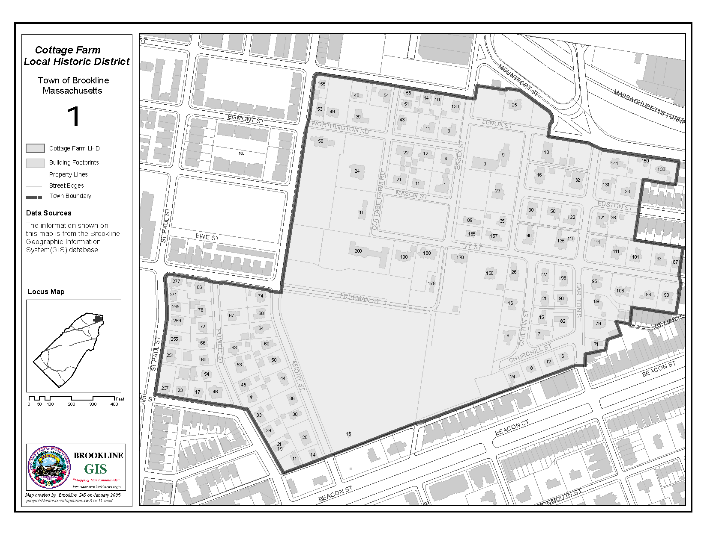
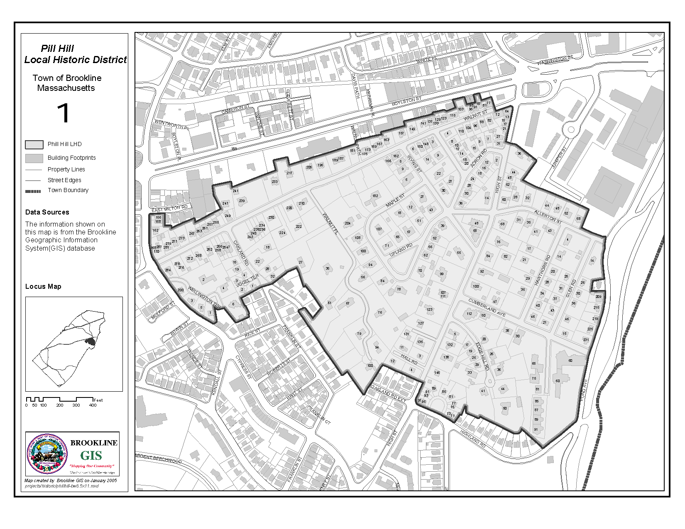
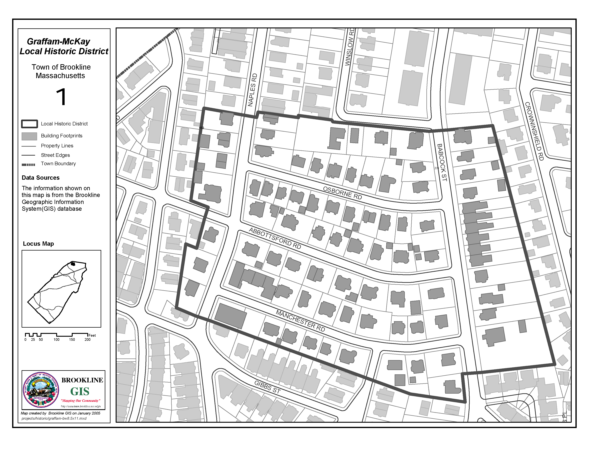
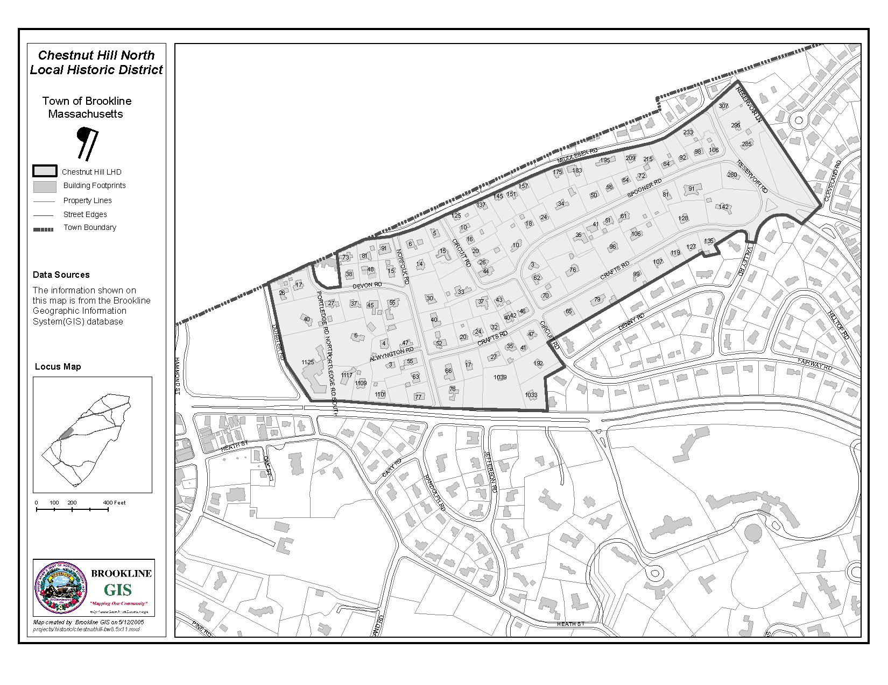
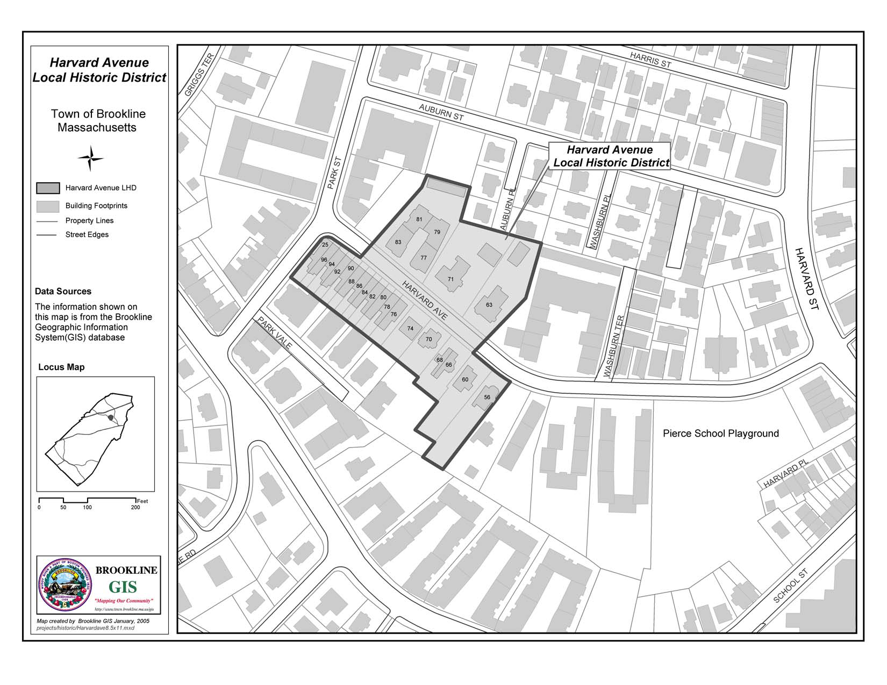

## ARTICLE 5.6<br/>PRESERVATION COMMISSION & HISTORIC DISTRICTS BY-LAW

### SECTION 5.6.1 TITLE

```
This By-law shall be known and may be cited as the Historic
Districts By-law under the authority of Massachusetts
General Laws, Chapter 40C, as amended.
```

### SECTION 5.6.2 PURPOSE

```
The purpose of this By-law is to promote the educational,
cultural, physical, economic and general welfare of the
public through the preservation and protection of the
historical assets of Brookline, including buildings, sites
and districts of historical and architectural interest;
through the maintenance of such landmarks of the history of
Brookline, the Commonwealth and the Nation, and through the
development of appropriate uses and settings for such
buildings and places.
```

### SECTION 5.6.3 ESTABLISHMENT OF HISTORIC DISTRICTS

```
(a)  Cottage Farm Historic District
     There is hereby established an Historic District,
     entitled the "Cottage Farm Historic District", the
     boundaries of which shall be as shown on the map
     entitled "Brookline Historic District" which
     accompanies and is hereby declared to be a part of
     this By-law.

(b)  Pill Hill Historic District
     There were established and are hereby reaffirmed
     historic districts, plans showing the boundaries of
     which are on file in the Preservation Commission
     office.  Copies of the plans follow at the end of this
     by-law, which plans are incorporated herein by
     reference and are hereby declared to be a part of this
     By-law.

(c) Graffam-McKay Local Historic District
     There is hereby established an Historic District, to
     be entitled the "Graffam-McKay Historic District", the
     boundaries of which shall be shown on the map entitled
     "Graffam-McKay Historic District", a copy of which is
     on file with the Town Clerk's office, which
     accompanies and is hereby declared to be part of this
     By-law.

(d) Chestnut Hill North Local Historic District
     There is hereby established an Historic District, to
     be entitled the "Chestnut Hill North Historic
     District", the boundaries of which shall be shown on
     the map entitled " Chestnut Hill North Historic
     District", a copy of which is on file with the Town
     Clerk's office, which accompanies and is hereby
     declared to be part of this By-law.

(e)  Harvard Avenue Local Historic District
     There is hereby established an Historic District, to
     be entitled the "Harvard Avenue Historic District",
     the boundaries of which shall be shown on the map
     entitled " Harvard Avenue Historic District", a copy
     of which is on file with the Town Clerk's office,
     which accompanies and is hereby declared to be part of
     this By-law.

(f)  Other Historic Districts
     Other Historic Districts within the Town may be
     established from time to time in accordance with the
     procedures set forth in Chapter 40C of the
     Massachusetts General Laws, as amended from time to
     time.
```

### SECTION 5.6.4 MEMBERSHIP OF THE PRESERVATION COMMISSION

```
The Brookline Preservation Commission, hereinafter referred
to as the Preservation Commission, shall consist of seven
(7) members appointed by the Selectmen.  The terms of
office expire on August 31, unless otherwise specified by
the Selectmen or unless such appointment is for an
indefinite term.

The membership of the Preservation Commission shall be made
up as follows:

     "One member who is selected from two (2) nominees
     submitted by the Brookline Preservation Commission;
     one member, if possible, who is selected from two (2)
     nominees whose names are submitted by the American
     Institute of Architects; one member, if possible, who
     is selected from two (2) nominees whose names are
     submitted by the Greater Boston Real Estate Board; and
     four (4) members, if possible, who are residents of an
     Historic District and, to the extent possible, at
     least one of whom resides in each established Historic
     District in the Town."

If membership cannot be appointed as designated above,
these positions shall be filled without designation.

All nominees shall be residents of the Town of Brookline.
One member, if possible, shall be an attorney.

When the Preservation Commission is first established, two
(2) members shall be appointed for one (1) year term, two
(2) members shall be appointed for two (2) year terms, and
the remaining members shall be appointed for (3) year
terms, and all members shall serve until a successor is
appointed and confirmed.  At the expiration of their terms,
the Selectmen shall appoint successors for three (3) year
terms in the manner described in the preceding paragraphs.
Vacancies for any unexpired term shall be filled in the
same manner as in the original appointment.

The Preservation Commission shall elect annually a Chairman
and Vice-Chairman from its own number and a Secretary from
within or without its number.

All members shall serve without compensation.

"The Selectmen may also appoint up to four (4) alternate
members of the Preservation Commission, who need not be
from the organizations designated above as entitled to
nominate members but who shall, to the extent possible,
consist of residents of each Historic District.  Such
alternates shall be appointed for three year terms and
shall be designated by the chairman of the Preservation
Commission from time to time to take the place of members
who are absent or unable or unwilling to act for any
reason.

Each member and alternate member shall continue in office
after the expiration of his or her term and until his or
her successor is duly appointed and qualified."  The terms
of office expire on August 31, unless otherwise specified
by the Selectmen or unless such appointment is for an
indefinite term.
```

### SECTION 5.6.5 DEFINITIONS

```
As used in this By-law, the following words and phrases
shall include the meanings indicated below:

(a)  The word "altering" shall include "rebuilding,
     reconstructing, restoring, removing, demolishing,
     changing exterior color, and any combination of the
     foregoing.

(b)  The word "constructing" shall include the terms
     "building," "erecting," "installing," "enlarging" and
     "moving".

(c)  The word "building" shall mean a combination of
     materials forming a shelter for persons, animals or
     property.

(d)  The word "structure" shall mean a combination of
     materials other than a building, including but not
     limited to a sign, fence, wall, terrace, walk or
     drive-way, tennis court and swimming pool.

(e)  The words "exterior architectural feature" shall mean
     such portion of the exterior of a building or
     structure as is open to view from a public street,
     public way or public park, including but not limited
     to the architectural style and general arrangement and
     setting thereof, the kind, color and texture of
     exterior building materials, the color of paint or
     other materials applied to exterior surface and the
     type and style of windows, doors, lights, signs and
     other appurtenant exterior fixtures.

(f)  The term "Historic District" or "Historic Districts"
     shall mean the established "Historic Districts in the
     Town, collectively.

(g)  The word "Commission" shall mean the Brookline
     Preservation Commission acting as such.
```

### SECTION 5.6.6 ADMINISTRATION OF HISTORIC DISTRICTS

```
No building or structure within the Historic District shall
be constructed, demolished, moved or altered in any way
that affects exterior architectural features and no
building shall be moved into an Historic District unless
the Commission shall first have issued a Certificate of
Appropriateness, a Certificate of Hardship or a Certificate
of Non-Applicability with respect to such construction,
alteration or movement.  The Building Inspector shall not
issue a permit within an Historic District unless one of
the certificates noted above has first been issued by the
Preservation Commission or the proposed improvement is
exempted from these provisions by Section 5.6.7.
```

### SECTION 5.6.7 EXEMPTIONS TO REVIEW

```
The authority of the Preservation Commission is not
extended to the review of the following:

(a)  Temporary signs or structures subject to requirements
     of the local zoning code and/or planning board.

(b)  Terraces, walks, driveways, sidewalks and other
     similar structures provided that the structure is at
     grade level with the qualification that on-grade areas
     intended for parking more than four motor vehicles are
     subject to review by the Preservation Commission to
     assure that adequate planting, earth berms, walls or
     similar structures are implemented to screen or
     regulate the physical scale of the areas and to
     minimize their visual impact as viewed from public
     ways.

(c)  Storm doors and windows; screen doors and windows;
     window air conditioners, antennae and similar
     appurtenances, any one or more of them with the
     qualification that free standing lighting fixtures are
     subject to review by the Preservation Commission.

(d)  Color of paint.

(e)  Signs used for residential occupation or professional
     purposes which are not more than one foot square in
     area, provided that:
          1.   Only one sign is displayed for each building
               or structure;
          2.   The sign consists of letters painted on wood
               without a symbol or trademark; and
          3.   If illuminated, is illuminated only
               indirectly.
(f)  Reconstructions of a building, structure or exterior
     architectural feature which has been damaged or
     destroyed by fire, storm or other disaster, provided
     that:
          1.   The exterior design is substantially similar
               to the original;
          2.   The reconstruction is begun within one year
               after the damage occurred and is carried on
               with "due diligence";
          3.   Replacement of deteriorated roofing
               components shall match as nearly as possible
               the original materials and new materials
               colored other than in the brown, black, gray
               or slate ranges shall be subject to review
               by the Preservation Commission.  Use of roof
               solar heating panels are similarly subject
               to commission review;
          4.   Reconstructions utilize the original
               foundations placed in the same location so
               as to respect the character of the massing
               of the original volume(s).  The authority of
               the commission is limited to the exterior
               architectural features within the district
               which are visible from one or more
               designated public streets, public ways,
               public parks or public water bodies.
```

### SECTION 5.6.8 POWER OF THE PRESERVATION COMMISSION

```
The District Commission shall have all the powers of an
Historic Preservation Commission as described in Chapter
40C of the Massachusetts General Laws.  The Commission
shall adopt rules and regulations for the conduct of its
business, not inconsistent with Chapter 40C of the General
Laws, or with the purpose of this By-law.

The Preservation Commission may receive and accept
appropriations, grants and gifts for furthering of the
purposes of this By-law.

The Preservation Commission shall propose changes in
Brookline Historic District boundaries as it deems
appropriate.  Massachusetts General Laws, Chapter 40C, will
guide the procedures for these activities.
```

### SECTION 5.6.9 SEVERABILITY

```
In case any section, paragraph or part of the By-law be for
any reason declared invalid or unconstitutional by any
court of last resort, every other section, paragraph or
part shall continue in full force and effect.
```

### SECTION 5.6.10 SCHEDULE OF FEES

```
A filing fee shall be included with all applications for
certificates.  Said fees shall be set, and may be amended
from time to time, by the Board of Selectmen.

        PLANS OF THE HISTORICAL DISTRICTS ARE ON FILE
         WITH THE BROOKLINE PRESERVATION COMMISSION
          COPIES ARE ON THE FOLLOWING FIVE PAGES
```





